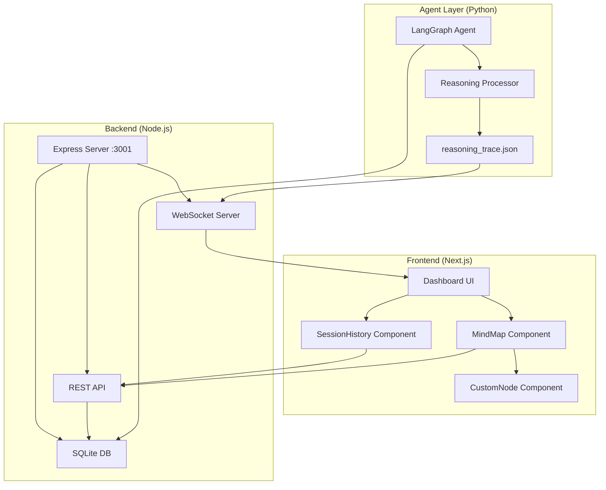

# AI Agent Mind Map Visualizer - System Design

**Version**: 3.0  
**Last Updated**: 2025-11-23  
**Status**: Production Ready

---

## Executive Summary

The AI Agent Mind Map Visualizer is a real-time transparency tool for AI agent reasoning processes. It combines LangGraph state management with a modern React dashboard to provide interactive visualization of agent decision-making, complete with time-travel capabilities and branch management.

**Key Features**:
- Real-time mind map visualization of agent reasoning
- LangGraph-based state persistence with SQLite checkpointing
- Time-travel: Navigate through agent history and create alternative timelines
- Glassmorphism UI with custom node rendering
- Auto-layout using Dagre graph algorithm

---

## System Architecture



### Component Overview

| Component | Technology | Port | Purpose |
|-----------|-----------|------|---------|
| Dashboard | Next.js 16 + React Flow | 3000 | UI visualization |
| API Server | Node.js + Express | 3001 | REST API & WebSocket |
| Database | SQLite | - | State persistence |
| Agent | Python + LangGraph | - | Reasoning engine |

---

## Data Flow

### 1. Agent Execution Flow

```
Agent Task → LangGraph Workflow → State Updates → SQLite Checkpoint
                                                 ↓
                                          reasoning_trace.json
                                                 ↓
                                          File Watcher (server.js)
                                                 ↓
                                          WebSocket Emit
                                                 ↓
                                          Dashboard Update
```

### 2. Session Loading Flow

```
User Clicks Session → GET /api/sessions/:id/nodes → SQLite Query
                                                    ↓
                                              Node Data + State
                                                    ↓
                                              Dagre Layout
                                                    ↓
                                              React Flow Render
```

### 3. Branching Flow

```
User Clicks Node → Branch Button → POST /api/sessions/:id/branch
                                                    ↓
                                          Create New Session
                                                    ↓
                                          Link Parent Session
                                                    ↓
                                          Emit Refresh Event
                                                    ↓
                                          Update Session List
```

---

## API Specification

### Base URL
`http://localhost:3001/api`

### Endpoints

#### 1. Get All Sessions
```http
GET /sessions
```

**Response**:
```json
[
  {
    "session_id": "uuid",
    "parent_session_id": "uuid | null",
    "prompt": "string",
    "created_at": "ISO 8601",
    "step_count": 23
  }
]
```

#### 2. Get Session Nodes
```http
GET /sessions/:sessionId/nodes
```

**Response**:
```json
[
  {
    "id": 305,
    "node_name": "step_1",
    "parent_node_id": null,
    "started_at": "ISO 8601",
    "finished_at": "ISO 8601",
    "state": {
      "step": 1,
      "thought": "string",
      "decision": "string",
      "file_examined": "string",
      "alternatives": []
    },
    "output_text": "string"
  }
]
```

#### 3. Create Branch
```http
POST /sessions/:sessionId/branch
Content-Type: application/json

{
  "checkpoint_node_id": 305,
  "prompt": "Branch description"
}
```

**Response**:
```json
{
  "new_session_id": "uuid",
  "parent_session_id": "uuid",
  "checkpoint_node_id": 305,
  "checkpoint_state": { /* state object */ },
  "message": "Branch created successfully"
}
```

#### 4. Resume from Checkpoint
```http
POST /sessions/:sessionId/resume
Content-Type: application/json

{
  "checkpoint_node_id": 305
}
```

**Response**:
```json
{
  "session_id": "uuid",
  "checkpoint_node_id": 305,
  "state": { /* cumulative state */ }
}
```

---

## Database Schema

### Tables

#### `sessions`
```sql
CREATE TABLE sessions (
    session_id TEXT PRIMARY KEY,
    parent_session_id TEXT,
    prompt TEXT NOT NULL,
    created_at TEXT NOT NULL,
    FOREIGN KEY (parent_session_id) REFERENCES sessions(session_id)
);
```

#### `node_executions`
```sql
CREATE TABLE node_executions (
    id INTEGER PRIMARY KEY AUTOINCREMENT,
    session_id TEXT NOT NULL,
    node_name TEXT NOT NULL,
    parent_node_id INTEGER,
    started_at TEXT NOT NULL,
    finished_at TEXT NOT NULL,
    state_update_json TEXT,
    output_text TEXT,
    FOREIGN KEY (session_id) REFERENCES sessions(session_id),
    FOREIGN KEY (parent_node_id) REFERENCES node_executions(id)
);
```

#### `checkpoints` (LangGraph Internal)
Managed by LangGraph's `SqliteSaver` for state persistence.

---

## UI Components

### Component Hierarchy

```
page.tsx
├── SessionHistory
│   ├── Session List
│   ├── Refresh Button
│   └── Empty State
└── MindMap
    ├── ReactFlow Canvas
    │   ├── CustomNode (multiple)
    │   ├── Edges
    │   └── Controls
    └── Node Details Panel
        ├── Thought Display
        ├── Decision Display
        └── Branch Button
```

### CustomNode Component

**Features**:
- Dynamic icon based on node type (Brain, Terminal, FileCode, CheckCircle)
- Glassmorphism styling with backdrop blur
- Hover effects and selection states
- File badge for nodes with file references
- Branch indicator for branched sessions

**Props**:
```typescript
interface CustomNodeData {
  step: number;
  thought: string;
  decision: string;
  file?: string;
  isBranch?: boolean;
}
```

### SessionHistory Component

**Features**:
- Auto-refresh on branch creation
- Loading and error states with icons
- Branched session indicators
- Active session highlighting
- Timestamp formatting

### MindMap Component

**Features**:
- Dagre auto-layout (top-to-bottom tree)
- Custom node types
- Animated edges
- Node selection and details panel
- Branch creation workflow

---

## Styling System

### Color Palette

| Color | Hex | Usage |
|-------|-----|-------|
| Background | `#0a0a0f` | Main background |
| Surface | `#1f2937` | Cards, panels |
| Border | `#374151` | Dividers, outlines |
| Primary | `#3b82f6` | Actions, links |
| Success | `#10b981` | Positive states |
| Warning | `#f59e0b` | Branches, alerts |
| Error | `#ef4444` | Errors |

### Design Tokens

- **Glassmorphism**: `bg-gray-900/80 backdrop-blur-xl`
- **Shadows**: `shadow-2xl shadow-blue-900/20`
- **Borders**: `border border-gray-700/50`
- **Transitions**: `transition-all duration-200`

---

## File Structure

```
Agents Neural Mind map/
├── cli/
│   ├── server.js              # Express + WebSocket server
│   ├── langgraph_agent.py     # LangGraph workflow
│   ├── database/
│   │   └── init_db.py         # Database initialization
│   ├── test_phase1.py         # Phase 1 tests
│   ├── test_phase2.js         # Phase 2 tests
│   └── requirements.txt       # Python dependencies
├── dashboard/
│   ├── app/
│   │   └── page.tsx           # Main page
│   ├── components/
│   │   ├── CustomNode.tsx     # Custom node component
│   │   ├── MindMap.tsx        # Mind map visualization
│   │   └── SessionHistory.tsx # Session sidebar
│   └── types/
│       └── mindmap.ts         # TypeScript interfaces
├── reasoning_trace.json       # Agent reasoning log
└── agent_mindmap.db          # SQLite database
```

---

## Deployment

### Prerequisites

- Node.js 18+
- Python 3.10+
- npm 9+

### Installation

```bash
# Install Node.js dependencies
cd dashboard && npm install
cd ../cli && npm install

# Install Python dependencies
pip install -r cli/requirements.txt

# Initialize database
python cli/database/init_db.py
```

### Running the Application

```bash
# Terminal 1: Start the API server
cd cli
node server.js

# Terminal 2: Start the dashboard
cd dashboard
npm run dev
```

**Access**:
- Dashboard: `http://localhost:3000`
- API: `http://localhost:3001`

---

## Testing

### Phase 1: LangGraph Integration
```bash
python cli/test_phase1.py
python cli/verify_phase1.py
```

### Phase 2: API & UI
```bash
node cli/test_phase2.js
```

### Manual Testing Checklist

- [ ] Session list loads correctly
- [ ] Clicking a session loads its mind map
- [ ] Nodes display with correct icons and data
- [ ] Clicking a node shows details panel
- [ ] Branch button creates new session
- [ ] New session appears in sidebar
- [ ] Branched sessions show indicator

---

## Performance Considerations

### Optimizations

1. **Dagre Layout**: Computed once per session load, cached in component state
2. **React Flow**: Uses `memo` for CustomNode to prevent unnecessary re-renders
3. **WebSocket**: Only emits on file changes, not polling
4. **SQLite**: Indexed on `session_id` and `parent_node_id`

### Scalability

- **Current**: Handles 100+ nodes per session smoothly
- **Limit**: React Flow recommended max ~500 nodes
- **Solution**: Implement pagination or virtualization for large sessions

---

## Security Considerations

> [!WARNING]
> This is a development tool. Do not expose to public networks.

- **CORS**: Enabled for `localhost` only
- **Authentication**: None (local development)
- **Database**: File-based SQLite (no network access)
- **API**: No rate limiting (trusted local environment)

---

## Future Enhancements

### Planned Features

1. **Search & Filter**: Find specific thoughts or decisions
2. **Export**: Download session as JSON or image
3. **Minimap**: Navigation aid for large graphs
4. **Keyboard Navigation**: Arrow keys to traverse nodes
5. **Session Tree View**: Hierarchical display of branches
6. **Real-time Collaboration**: Multi-user viewing

### Technical Debt

- Add TypeScript strict mode
- Implement comprehensive error boundaries
- Add unit tests for components
- Create E2E tests with Playwright
- Externalize configuration (env variables)

---

## Troubleshooting

### Common Issues

**Dashboard shows "No sessions"**
- Ensure `agent_mindmap.db` exists
- Run `python cli/database/init_db.py`
- Check server logs for database errors

**Nodes not appearing**
- Verify `reasoning_trace.json` has valid JSON
- Check browser console for errors
- Ensure `dagre` and `@types/dagre` are installed

**Branch button not working**
- Check server is running on port 3001
- Verify CORS is enabled
- Check browser network tab for failed requests

**Layout looks broken**
- Clear browser cache
- Restart Next.js dev server
- Check for CSS conflicts in browser DevTools

---

## References

- [LangGraph Documentation](https://langchain-ai.github.io/langgraph/)
- [React Flow Documentation](https://reactflow.dev/)
- [Dagre Layout](https://github.com/dagrejs/dagre)
- [Next.js Documentation](https://nextjs.org/docs)
